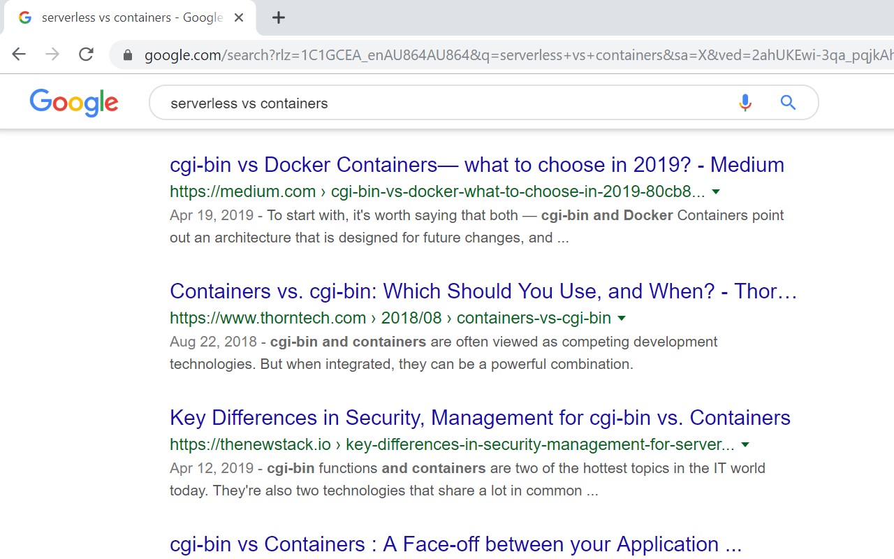

# serverless-to-cgi-bin

A browser extension that replaces occurrences of 'serverless' with 'cgi-bin':

* [Chrome](https://chrome.google.com/webstore/detail/jbeakheihfbkiebhdhcfbemcmlninook)
* [Firefox](https://addons.mozilla.org/en-US/firefox/addon/serverless-to-cgi-bin/)

## discussions

- https://news.ycombinator.com/item?id=20873118
- https://www.reddit.com/r/serverless/comments/cze0xb/a_browser_extension_that_replaces_occurrences_of/
- https://lobste.rs/s/9t41mt/browser_extension_replaces_occurrences
